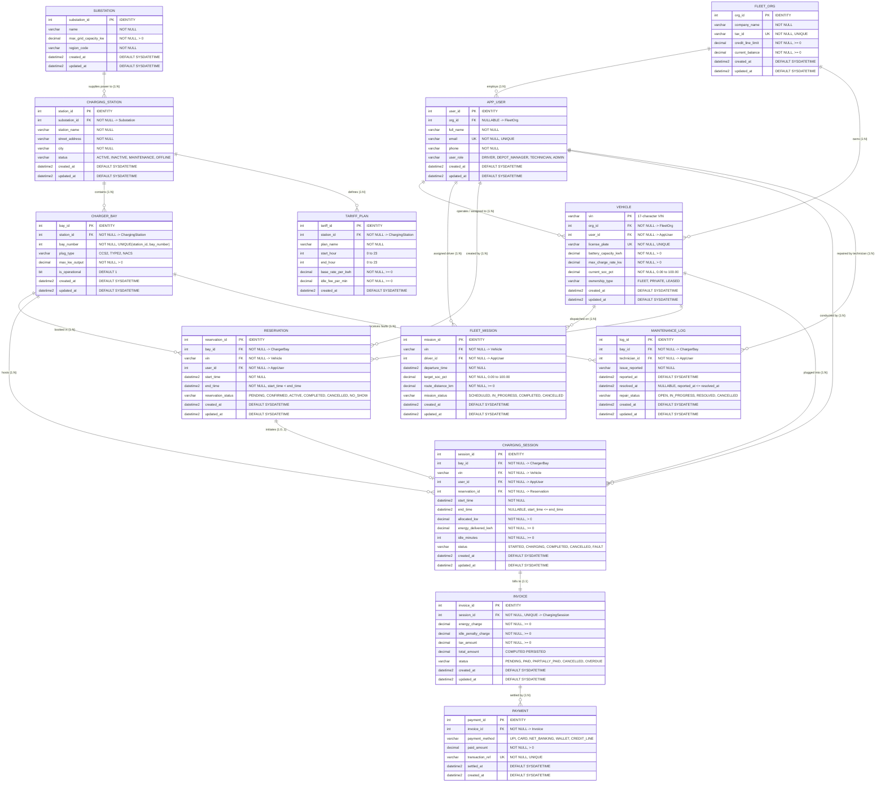

# Entity-Relationship (ER) Diagram & Data Dictionary

## 1. Overview
This document provides the structural reference, Mermaid ER diagram, and complete data dictionary for the **Intelligent EV Charging Station and Fleet/Depot Management System**.

The database models the physical electrical hierarchy from upstream substations to charging stations and charger bays, while orchestrating commercial fleet missions, vehicle charging limits, reservations, active charging sessions, automated invoicing, payments, and hardware maintenance.

---

## 2. Mermaid Entity-Relationship Diagram

---

## 3. Detailed Data Dictionary

### 3.1 Substation
Supplies electrical high-voltage energy to downstream charging stations.
* **substation_id** (`INT IDENTITY(1,1)`, PK): Unique surrogate identifier.
* **name** (`VARCHAR(100)`, NOT NULL): Human-readable name of the utility substation.
* **max_grid_capacity_kw** (`DECIMAL(10,2)`, NOT NULL): Licensed peak transformer power limit in kilowatts. Checked by constraint `max_grid_capacity_kw > 0`.
* **region_code** (`VARCHAR(20)`, NOT NULL): Grid operator jurisdiction or distribution code.
* **created_at**, **updated_at** (`DATETIME2(7)`, NOT NULL): System audit timestamps.

### 3.2 ChargingStation
Physical depot or public charging plaza containing multiple charger bays.
* **station_id** (`INT IDENTITY(1,1)`, PK): Unique surrogate identifier.
* **substation_id** (`INT`, FK to `Substation`): Supplying grid substation.
* **station_name** (`VARCHAR(100)`, NOT NULL): Public or fleet facility identifier.
* **street_address** (`VARCHAR(255)`, NOT NULL): Physical address.
* **city** (`VARCHAR(100)`, NOT NULL): City location.
* **status** (`VARCHAR(20)`, NOT NULL): Station status constrained to `ACTIVE`, `INACTIVE`, `MAINTENANCE`, `OFFLINE`.

### 3.3 ChargerBay
Individual parking stall with a dedicated EVSE dispenser connector.
* **bay_id** (`INT IDENTITY(1,1)`, PK): Unique surrogate identifier.
* **station_id** (`INT`, FK to `ChargingStation`): Hosting charging station.
* **bay_number** (`INT`, NOT NULL): Bay number within the facility. Composite unique constraint `UQ_ChargerBay_Station_Bay (station_id, bay_number)`.
* **plug_type** (`VARCHAR(20)`, NOT NULL): Constrained to `CCS2`, `TYPE2`, `NACS`.
* **max_kw_output** (`DECIMAL(8,2)`, NOT NULL): Maximum DC or AC nameplate delivery rating (`> 0`).
* **is_operational** (`BIT`, NOT NULL, DEFAULT 1): Automatic hardware availability status (0 = under maintenance/fault, 1 = operational).

### 3.4 TariffPlan
Time-of-use pricing matrix defining energy rates and idle overstay penalties.
* **tariff_id** (`INT IDENTITY(1,1)`, PK): Unique surrogate identifier.
* **station_id** (`INT`, FK to `ChargingStation`): Facility to which this tariff applies.
* **plan_name** (`VARCHAR(50)`, NOT NULL): E.g., Daytime Peak, Night Off-Peak.
* **start_hour**, **end_hour** (`INT`, NOT NULL): Hours (0 to 23). Accommodates overnight wrapping (e.g., 22:00 to 06:00).
* **base_rate_per_kwh** (`DECIMAL(10,4)`, NOT NULL): Rate per kilowatt-hour.
* **idle_fee_per_min** (`DECIMAL(10,4)`, NOT NULL): Penalty per minute for post-charging bay occupancy.

### 3.5 FleetOrg
Commercial fleet enterprise, logistics carrier, or transit authority.
* **org_id** (`INT IDENTITY(1,1)`, PK): Unique surrogate identifier.
* **company_name** (`VARCHAR(150)`, NOT NULL): Legal business entity name.
* **tax_id** (`VARCHAR(50)`, UNIQUE, NOT NULL): Official tax or registration number.
* **credit_line_limit** (`DECIMAL(12,2)`, NOT NULL, DEFAULT 0.00): Maximum allowable credit for monthly charging settlement.
* **current_balance** (`DECIMAL(12,2)`, NOT NULL, DEFAULT 0.00): Outstanding unpaid credit line balance.

### 3.6 AppUser
Personnel and retail drivers interacting with the charging infrastructure.
* **user_id** (`INT IDENTITY(1,1)`, PK): Unique surrogate identifier.
* **org_id** (`INT`, FK to `FleetOrg`, NULLABLE): Enrolled fleet organization. NULL for retail drivers.
* **full_name** (`VARCHAR(100)`, NOT NULL): Driver or technician name.
* **email** (`VARCHAR(150)`, UNIQUE, NOT NULL): Account email address.
* **phone** (`VARCHAR(25)`, NOT NULL): Contact phone number.
* **user_role** (`VARCHAR(20)`, NOT NULL): Constrained to `DRIVER`, `DEPOT_MANAGER`, `TECHNICIAN`, `ADMIN`.

### 3.7 Vehicle
Electric vehicle registered for charging and fleet missions.
* **vin** (`VARCHAR(17)`, PK): Unique 17-character vehicle identification number.
* **org_id** (`INT`, FK to `FleetOrg`): Registered fleet organization or default enterprise sponsor.
* **user_id** (`INT`, FK to `AppUser`): Primary driver or operator.
* **license_plate** (`VARCHAR(20)`, UNIQUE, NOT NULL): State registration plate.
* **battery_capacity_kwh** (`DECIMAL(8,2)`, NOT NULL): Total battery pack capacity (`> 0`).
* **max_charge_rate_kw** (`DECIMAL(8,2)`, NOT NULL): Maximum DC fast charge ingestion limit (`> 0`).
* **current_soc_pct** (`DECIMAL(5,2)`, NOT NULL, DEFAULT 50.00): Current State-of-Charge percentage (0.00 to 100.00). *Design improvement.*
* **ownership_type** (`VARCHAR(20)`, NOT NULL): Constrained to `FLEET`, `PRIVATE`, `LEASED`.

### 3.8 FleetMission
Scheduled commercial route or transit dispatch with strict departure deadlines.
* **mission_id** (`INT IDENTITY(1,1)`, PK): Unique surrogate identifier.
* **vin** (`VARCHAR(17)`, FK to `Vehicle`): Dispatched vehicle.
* **driver_id** (`INT`, FK to `AppUser`): Assigned commercial driver.
* **departure_time** (`DATETIME2(7)`, NOT NULL): Target wheels-up timestamp.
* **target_soc_pct** (`DECIMAL(5,2)`, NOT NULL): Required battery SOC percentage before departure (0.00 to 100.00).
* **route_distance_km** (`DECIMAL(8,2)`, NOT NULL, DEFAULT 0.00): Projected route mileage.
* **mission_status** (`VARCHAR(20)`, NOT NULL): Constrained to `SCHEDULED`, `IN_PROGRESS`, `COMPLETED`, `CANCELLED`.

### 3.9 Reservation
Time-window booking securing a specific bay for a vehicle.
* **reservation_id** (`INT IDENTITY(1,1)`, PK): Unique surrogate identifier.
* **bay_id** (`INT`, FK to `ChargerBay`): Reserved charging bay.
* **vin** (`VARCHAR(17)`, FK to `Vehicle`): Vehicle booked.
* **user_id** (`INT`, FK to `AppUser`): Booking user.
* **start_time**, **end_time** (`DATETIME2(7)`, NOT NULL): Reservation window (`start_time < end_time`). Enforced against overlapping intervals by trigger and serializable locks.
* **reservation_status** (`VARCHAR(20)`, NOT NULL): Constrained to `PENDING`, `CONFIRMED`, `ACTIVE`, `COMPLETED`, `CANCELLED`, `NO_SHOW`.

### 3.10 ChargingSession
Physical energy dispensing event linking reservation, charger bay, and vehicle.
* **session_id** (`INT IDENTITY(1,1)`, PK): Unique surrogate identifier.
* **bay_id** (`INT`, FK to `ChargerBay`): Hardware bay dispensing power.
* **vin** (`VARCHAR(17)`, FK to `Vehicle`): EV receiving power.
* **user_id** (`INT`, FK to `AppUser`): Operating user.
* **reservation_id** (`INT`, FK to `Reservation`): Originating reservation.
* **start_time** (`DATETIME2(7)`, NOT NULL): Session initiation timestamp.
* **end_time** (`DATETIME2(7)`, NULLABLE): Session termination timestamp (`start_time <= end_time`).
* **allocated_kw** (`DECIMAL(8,2)`, NOT NULL): Actively negotiated charging power draw. Must not breach bay rating, vehicle rating, or upstream substation headroom.
* **energy_delivered_kwh** (`DECIMAL(10,3)`, NOT NULL, DEFAULT 0.000): Metred electricity transferred.
* **idle_minutes** (`INT`, NOT NULL, DEFAULT 0): Post-charge vehicle dwell time.
* **status** (`VARCHAR(20)`, NOT NULL): Constrained to `STARTED`, `CHARGING`, `COMPLETED`, `CANCELLED`, `FAULT`.

### 3.11 MaintenanceLog
Tracks hardware anomalies, repair tickets, and technician interventions.
* **log_id** (`INT IDENTITY(1,1)`, PK): Unique surrogate identifier.
* **bay_id** (`INT`, FK to `ChargerBay`): Affected charger bay.
* **technician_id** (`INT`, FK to `AppUser`): Servicing technician.
* **issue_reported** (`VARCHAR(500)`, NOT NULL): Fault description.
* **reported_at** (`DATETIME2(7)`, NOT NULL, DEFAULT SYSDATETIME()).
* **resolved_at** (`DATETIME2(7)`, NULLABLE): Timestamp repair concluded.
* **repair_status** (`VARCHAR(20)`, NOT NULL): Constrained to `OPEN`, `IN_PROGRESS`, `RESOLVED`, `CANCELLED`. Open faults automatically mark `ChargerBay.is_operational = 0`.

### 3.12 Invoice
Financial invoice generated upon completion of a charging session.
* **invoice_id** (`INT IDENTITY(1,1)`, PK): Unique surrogate identifier.
* **session_id** (`INT`, FK to `ChargingSession`, UNIQUE): Exactly one invoice per charging session.
* **energy_charge** (`DECIMAL(10,2)`, NOT NULL): `energy_delivered_kwh * base_rate_per_kwh`.
* **idle_penalty_charge** (`DECIMAL(10,2)`, NOT NULL): `idle_minutes * idle_fee_per_min`.
* **tax_amount** (`DECIMAL(10,2)`, NOT NULL): Applicable statutory tax.
* **total_amount** (`DECIMAL(10,2)`, COMPUTED PERSISTED): `(energy_charge + idle_penalty_charge + tax_amount)`.
* **status** (`VARCHAR(20)`, NOT NULL): Constrained to `PENDING`, `PAID`, `PARTIALLY_PAID`, `CANCELLED`, `OVERDUE`.

### 3.13 Payment
Financial settlement transaction linked to an invoice.
* **payment_id** (`INT IDENTITY(1,1)`, PK): Unique surrogate identifier.
* **invoice_id** (`INT`, FK to `Invoice`): Associated invoice.
* **payment_method** (`VARCHAR(20)`, NOT NULL): Constrained to `UPI`, `CARD`, `NET_BANKING`, `WALLET`, `CREDIT_LINE`.
* **paid_amount** (`DECIMAL(10,2)`, NOT NULL): Currency amount paid (`> 0`).
* **transaction_ref** (`VARCHAR(100)`, UNIQUE, NOT NULL): Gateway or bank transaction reference.
* **settled_at** (`DATETIME2(7)`, NOT NULL, DEFAULT SYSDATETIME()).
